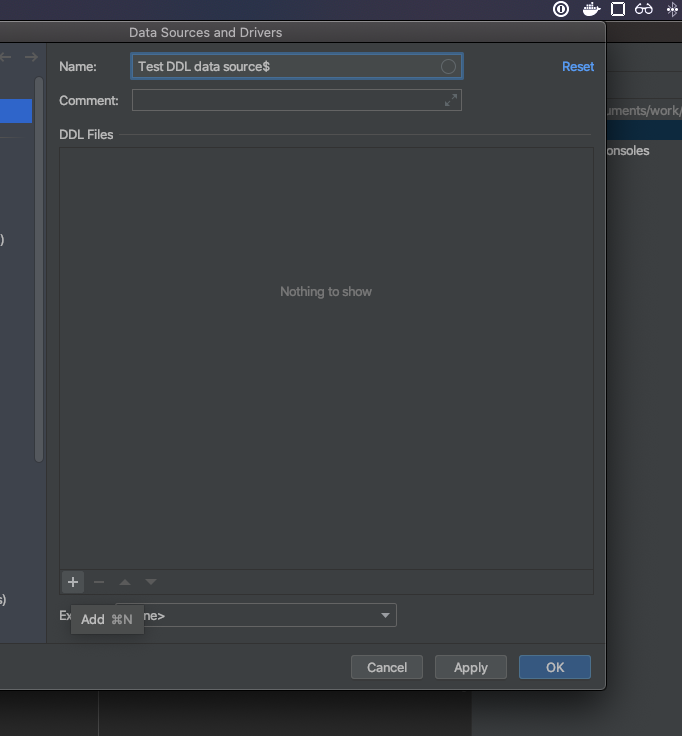

This will take you through generating an ERD from DDL statements using jetbrain's database IDE "Datagrip". This has the benefit of not needing to connect to a database.

### Attach a directory in Datagrip

In the right hand side you should see an icon to click that will allow you to attach a directory. This will be a directory on your computer that you store your DDL statements in.

### Create a new DDL data source

A DDL data source can be created by choosing the option in the normal "create datasource" dropdown

### Add the DDL file to the data source in the creation window 

In the bottom of the create datasource wizard window, you can click the `+` button to add a DDL file from the folder you specified in the first step.

### Generate the diagram

Now with the datasource setup, simply generate a diagram like you would for any other datasource.

